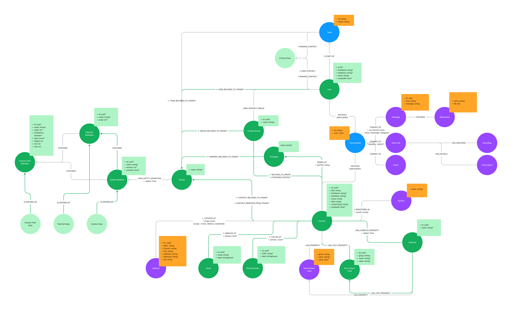

# Customer OS Base Model


# Env vars
| Name                       | Meaning                                                                                                  |
|----------------------------|----------------------------------------------------------------------------------------------------------|
| PORT                       | optional, specify the port of the api, defaults to 10000                                                  |
| GRAPHQL_PLAYGROUND_ENABLED | enables the graphql playground,a graphical, interactive, in-browser GraphQL IDE, optional, default faluse |
| NEO4J_TARGET               | *REQUIRED* url to connect to the neo4j database, must start with the neo4j:// prefix                     |
| NEO4J_AUTH_USER            | *REQUIRED* username to connect to the neo4j database                                                     |
| NEO4J_AUTH_PWD             | *REQUIRED* passowrd to connect to neo4j database                                                         |
| NEO4J_AUTH_REALM           | specify a Neo4J realm (optional, can be set to empty string)                                             |
| NEO4J_MAX_CONN_POOL_SIZE   | Neo4j connection pool size, optional defaults to 100                                                     |


## Adding new users (local development)
A script is available in
```
/deployment/scripts/neo4j
```

run
```
./adduser.sh
```
from that directory